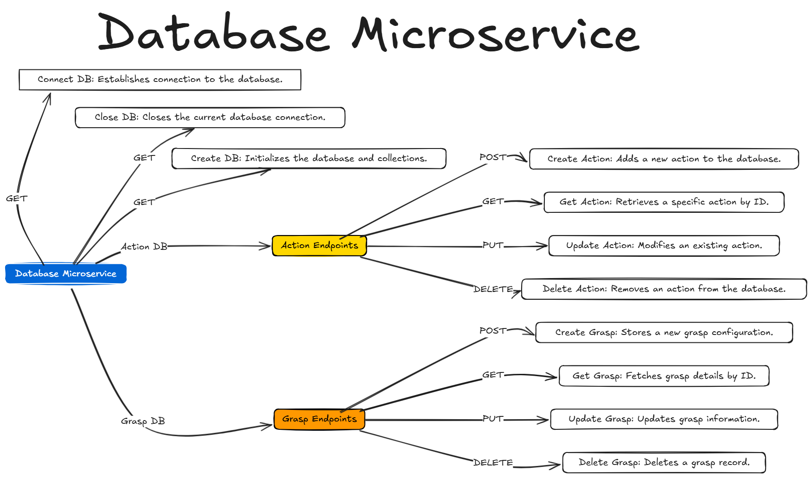

# Database MicroService Documentation

## Overview
This directory contains the database microservice implementation for the AIHand project, built with FastAPI and MongoDB integration.



## Structure
```
Database/
├── routers/
│   ├── router.py         # Core database connection routes
│   ├── action_routes.py  # Action-related endpoints
│   ├── grasp_routes.py   # Grasp-related endpoints
├── functions/
│   └── db_manager.py     # Database management functions
└── Readme.md            # This documentation file
```

## API Endpoints

### Core Database Routes (`/database`)
- `GET /connect_db` - Establish database connection
- `GET /close_db` - Close database connection
- `GET /create_db` - Initialize database and collections

### Action Routes (`/action_db`)
- `POST /create` - Create new action
- `GET /get` - Retrieve specific action
- `PUT /update` - Update existing action
- `DELETE /delete` - Delete action

### Grasp Routes (`/grasp_db`)
- `POST /create` - Create new grasp
- `GET /get` - Retrieve specific grasp
- `PUT /update` - Update existing grasp
- `DELETE /delete` - Delete grasp

## Request Models

### ActionRequest
```python
{
    "action_name": str,
    "tool": str,
    "object": str
}
```

### GraspRequest
```python
{
    "object_name": str,
    "grasp_distance": float,
    "pickup_mode": str
}
```

## Configuration
- Database settings are managed through `db_config.yaml`
- Configuration is loaded using the `load_config` utility

## Usage
1. Ensure MongoDB is running
2. Configure database settings in `db_config.yaml`
3. Start the FastAPI server
4. Access endpoints through the specified routes
